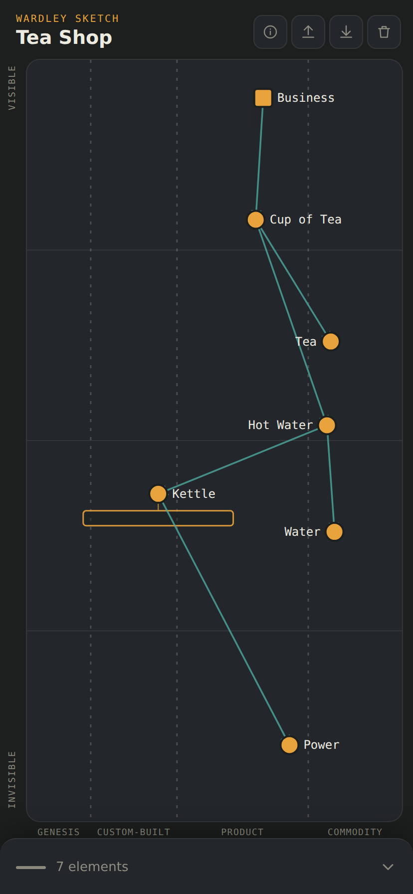
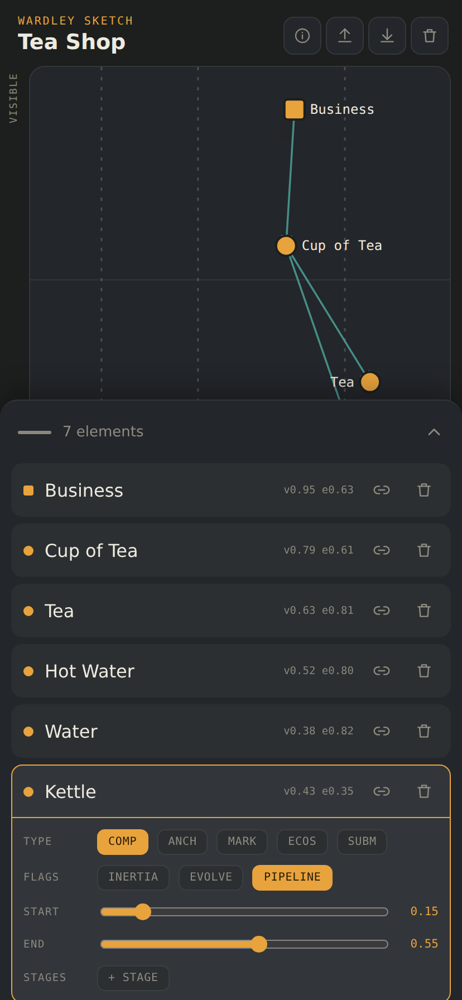

# Wardley Sketch

A minimalist, mobile-first sketch tool for Wardley Maps. Think digital napkin —
rough out a map on your phone in a couple of minutes, then export it as
OnlineWardleyMaps DSL and finish it in a fuller editor.

### ▸ [Open the app](https://wernercoetzeeza.github.io/wardley-sketch/)

Created by **Werner Coetzee** with Claude.ai — ExploreNew (Pty) Ltd · v1.7.3

---

## Why Wardley Sketch Exists

I built Wardley Sketch while reading *The Value Flywheel Effect*.

I wanted to practice Wardley Mapping as I read, often with just an iPad or my
phone. Existing desktop tools are excellent for workshops and detailed
modelling, but I found them cumbersome for quick sketching on mobile devices.

Wardley Sketch isn't trying to replace those tools. It's a digital napkin —
a fast, touch-first place to capture an idea in a few minutes, then export it
to OnlineWardleyMaps DSL when you want to refine it.

---

## Philosophy

Wardley Sketch is intentionally small.

- Mobile first
- Touch first
- Fast enough for a coffee shop conversation
- Fast enough to use while reading a book
- Compatible with the OnlineWardleyMaps DSL
- Not a replacement for desktop mapping tools

## Who is it for?

Wardley practitioners who want to:

- sketch ideas while reading
- capture maps during meetings
- think on an iPad or phone
- export later to OnlineWardleyMaps

---

## Screenshots

The classic Tea Shop map, with a pipeline on Kettle:

Tap a component to edit it — here Kettle is selected, showing its pipeline's
start and end sliders:

---

## Install it

Open the link above, then:

- **iPhone / iPad** — Share → *Add to Home Screen*
- **Android** — menu → *Install app* / *Add to Home screen*
- **Desktop** — the install icon in the address bar

It runs full screen with no browser chrome and works offline once installed.
Nothing is uploaded anywhere; maps stay on your device.

## Using it

| Action | Gesture |
|---|---|
| Add a component or note | **Hold** the canvas |
| Move something | **Drag** it |
| Zoom | **Pinch**; drag empty space to pan |
| Edit a component | **Tap** it — type, inertia, evolve, pipeline stages |
| Link two components | Tap the link icon on a row, then tap the target |

Components sit on the two Wardley axes: **visibility** up the side (how close to
the user) and **evolution** across the bottom (genesis to commodity).

## Import and export

The app reads and writes the [OnlineWardleyMaps](https://onlinewardleymaps.com/)
DSL, the de facto standard for maps-as-code.

- **Import** — paste DSL or open a `.owm` file
- **Export** — copy the DSL, or save a `.owm` file via the share sheet

Components, anchors, markets, ecosystems, submaps, **pipelines** (both the
`pipeline Name [x, y]` and nested `pipeline Name { ... }` forms), `evolve`,
`inertia`, notes, **annotations** (numbered markers, including multi-point
ones), label offsets and every link type are drawn on the canvas. Anything
the sketch tool doesn't draw — `style`, `size`, submap URLs — is **carried
through untouched**, so importing a map, tweaking it here, and exporting it
again never loses work.

## Credit where it's due

**Wardley Mapping was created by [Simon Wardley](https://blog.gardeviance.org/)**,
who developed the technique in 2005 and has given it freely to the community
under a Creative Commons Share Alike licence. This tool is only a sketchpad for
a method that is entirely his — if you're new to mapping, start with his writing
rather than with this app.

- Simon Wardley's blog, *Bits or pieces?* — <https://blog.gardeviance.org/>
- His book on mapping is serialised there, chapter by chapter

The map syntax used here is the **OnlineWardleyMaps (OWM)** DSL, created and
maintained by [Damon Skelhorn](https://onlinewardleymaps.com/).

- OnlineWardleyMaps — <https://onlinewardleymaps.com/>
- DSL reference — <https://docs.onlinewardleymaps.com/docs/dsl-reference/>

## Good to know

- Maps are stored in your browser's local storage, so they're **per-device and
  per-browser**. Export a `.owm` file to move a map elsewhere or keep a backup.
- Clearing your browser data will clear saved maps.
- Pipeline stages are editable in the app: tap a component, switch **Pipeline**
  on, then **+ Stage**. A pipeline with stages takes its extent from them, so
  the start/end sliders only appear while it has none.
- Annotations render and stay editable — rename, delete, or remove one
  placement from a multi-point one — but there's no on-canvas way to create
  a new one. They're a fairly advanced, infrequently-used construct, and the
  create gesture that would fit them well never earned its complexity in
  testing; import remains the way to add them.

## Licence

Copyright &copy; 2026 Werner Coetzee, ExploreNew (Pty) Ltd.
Released under the MIT Licence — see [`LICENSE`](LICENSE).

That covers this application's code only. The Wardley Mapping method itself is
Simon Wardley's work, shared under Creative Commons Share Alike, and is not
affected by the licence on this code.

---

Running your own copy or contributing? See [`DEVELOPING.md`](DEVELOPING.md).
Curious what's next, or what's been deliberately left out? See
[`ROADMAP.md`](ROADMAP.md).
